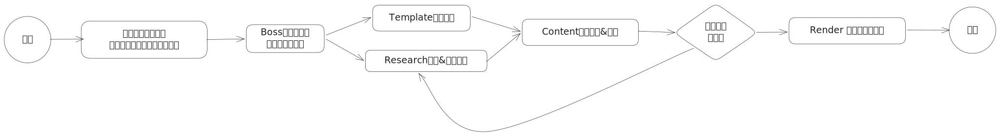

# PPT Smasher

一个基于 Eino 的 PPT 生成多智能体 Agent 编排。

受 [PPTAgent](https://github.com/icip-cas/PPTAgent)，[扣子](https://www.coze.cn/) 与 [Google NotebookLM](https://notebooklm.google.com/) 启发而设计。

许可证：[MIT](./LICENCE)

## 特色

- **Multi Agent 协同：** 采用树状“分层管理结构”设计，像[一支分工明确的外包团队](#agents-分工)一样，听从你的指令、参考你的资料、展示你的观点。
- **数据全透明：** 所有 Agent 的全部思考过程、工作日志、数据流向全部可以随时查阅与追踪。如果出现了任何方向或细节的跑偏，你随时可以打断工作流进行实时纠偏。
- **三维记忆库系统**：确保 Agent 既能精准理解你的每一份资料，又能像资深设计师一样专业地进行排版。

| 维度       | 内容                                  | 作用                |
| :--------- | :------------------------------------ | :------------------ |
| **内容维** | 文献、数据、插图、详细内容            | 提供 PPT 的**血肉** |
| **方法维** | 大纲、内容组织方式、排版/配色风格描述 | 提供 PPT 的**骨架** |
| **视觉维** | 配色描述、图标集、装饰组件库          | 提供 PPT 的**皮囊** |

> 其中内容维的数据使用了基于 LanceDB 的 RAG，另外两维的指令与规则则直接注入对应 Agent 的提示词中。

- **样式与内容解耦：** 支持只更换视觉风格，内容逻辑在不同模版间平滑迁移，真正实现“换装不换脑”。
- **断点级交互：** 在生成大纲、排版预览等每一个关键阶段，你都可以直接下令修改，实现“人机共创”的丝滑体验。

## Agents 分工

让我们来详细了解一下这支"专业外包团队"。这套架构深度借鉴了微服务解耦设计的思想，将不同领域的职责完全隔离开来，每个子 Agent 都作为父 Agent 的一个 Tool 被使用。

每支子团队都有一个 Leader 来统筹全局、评估与调度工作，形成闭环。

### Boss 项目经理

- **定位**：整个系统的“大脑”与状态机（Stateful Orchestrator）。
- **职责**：直接接收你的 PPT 主题与要求，但不亲自下场干活，而是只负责统筹全局。它通过 **ReAct（推理与行动）** 模式，动态评估当前进度，决定下一步是派发搜索任务、撰写大纲、还是开始排版。
- **人机协同**：它会在关键节点（如大纲生成后）将内容反馈给你进行确认（Outline & Content Confirmation）。如果发现资料不够，它也会主动向 Research Team 下达补全搜索的指令。

### Template Team 模板分析团队

- **定位**：连接人类优秀设计与机器代码的“拆解专家”。
- **职责**：全面解剖你上传的参考 PPT 模板，提取排版规律并将其翻译成下游机器能懂的指令。
- **团队成员**：
    - **Cluster Analyzer**：分析幻灯片的功能类型，分清哪些是支撑逻辑框架的“结构页”（如开场、目录），哪些是用于传递细节的“内容页”。
    - **Schema Extractor**：将底层啰嗦的 XML 格式转化为清晰的数据骨架，梳理出每个页面具体有哪些坑位（文本、图片及其用途）。
    - **HTML Renderer**： 将幻灯片渲染成直观的 HTML 格式，为后续的排版步骤提供精准的导航地图。

### Researcher 资料研究者

- **定位**：负责资料搜索与整合，将海量资料收敛成零散的知识。
- **职责**：吞吐你上传的参考资料，并根据 Boss 下发的搜索主题联网搜索补充。
- **并行工作流**：
    - `WebSearch` (基于 Tavily)：联网搜索图片、文献、统计资料。
    - `ParseDocs` (基于 MinerU)：先使用 MinerU 解析你上传的文档，再使用 VLM 根据文档中的图片、上传的其他图片生成简短的描述。
- **输出**：所有资料清洗后统一进行向量化（Index），存入 VDB，构建成项目专属的知识底座。

### Content Team 内容创作团队

- **定位**：负责逻辑与文案，将零散知识转化为结构化的表达。
- **职责**：通过从 VDB 检索（Retrieve）相关素材，完成从框架到逐字稿的创作闭环。
- **团队成员**：
    - **Outline Director**：起草符合逻辑流的 PPT 大纲，**并为每一页精准指定要套用的参考模板幻灯片**。
    - **Content Filler**：向大纲指定的各个模板骨架中，填充从 VDB 提取的文案和图片等“血肉”。
    - **Content Critic**：负责交叉比对填充内容与原始 VDB 事实，一旦发现逻辑断层或 AI 幻觉，立即打回重写，或向 Boss 申请“需要更多资料（Further search required）”。

### Render Team 视觉设计团队

- **定位**：负责排版与渲染，通过精准的代码编辑修改模板，输出最终幻灯片。
- **职责**：接收 Content Team 敲定的文案和分配好的 Schema，用程序化手段将其映射进参考风格中。
- **视觉闭环**：
    - `Script Coder`：从 负责根据 HTML 导航视图，生成可执行的编辑动作 Python 代码（如 `replace_span`、`replace_image`、`clone_paragraph` 等）去修改模板。代码生成后直接在本地执行，一旦碰到报错（如操作了不存在的元素），它会根据执行反馈进行自我纠错并重试，直到生成动作成功执行。
    - `PPTEval Judge`：基于大模型与PPTEval标准对生成的演示文稿进行最后验收。严格按照三大维度打分：**内容（Content）**（文案是否精简、配图是否契合）、**设计（Design）**（色彩是否和谐、是否存在元素重叠等瑕疵）和**连贯性（Coherence）**（逻辑发展是否顺畅、有无背景交代）。综合得分不达标的页面会被直接打回重审。
- **输出**：生成最终可供演示、版式完美且逻辑严密的 PPT 文件。

### 核心工作流

1.  **需求与物料注入 (Input & Initialization)** 你向 Boss 交代本次 PPT 的主题，并“喂”给它两样东西：一批**参考资料**（原始文本/数据）和一份**你中意的参考 PPT**（视觉模板）。
2.  **双线基建开工 (Parallel Preparation)**
    *   **知识线**：Research Team 吞吐参考资料，联网检索补充，清洗后全部存入向量数据库（VDB），构建项目专属知识底座。
    *   **视觉线**：Template Analyst 解剖你给的参考 PPT，提取出各个页面的内容结构（JSON Schema），并渲染出直观易读的 HTML 导航视图。
3.  **大纲与版式共创 (Outline & Layout Mapping)** Content Team 中的 `Outline Director` 根据 VDB 起草逻辑大纲。这里的关键是：**它会为大纲的每一页，精准指定一个刚才提取出的对应模板版式**。
    > Boss 会在这里把带着“版式规划”的大纲提交给你。你确认逻辑通顺、版式分配合理后，一键放行。
4.  **血肉精准填充 (Content Filling & Critic)** 大纲敲定后，`Content Filler` 将 VDB 里的详细文案、图表，精准地塞进分配好的 Schema 骨架的“坑位”中。内部的 `Content Critic` 负责死磕事实，防止出现逻辑断层或 AI 幻觉。
5.  **代码驱动渲染与纠错 (Code-Driven Rendering & REPL)**
    `Script Coder` 看着 HTML 视图和填好的 Schema，编写出（比如调用 `replace_span` 或 `replace_image` API）。脚本直接在内置沙盒中运行去修改底层模板。遇到报错，沙盒会提供执行反馈，Agent 据此自动改 Bug 并重试，直至动作全部成功。
6.  **冷酷终审与交付 (Final Evaluation & Delivery)** 幻灯片渲染完成后，`PPTEval Judge` 拿着“放大镜”上场，严格按照**内容 (Content)**、**设计 (Design)** 和**连贯性 (Coherence)** 三个核心维度打分。综合得分达标则大功告成，产出最终的 PPTX 文件；发现瑕疵（如文字溢出、逻辑不畅）则直接打回给对应环节重造。

## 致谢

本项目的实现思路与 Agent Prompt 极大程度上参考了[PPTAgent(DeepPresenter)](https://github.com/icip-cas/PPTAgent)，非常感谢！